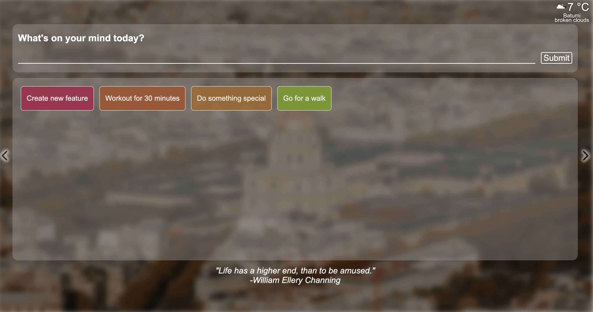

# Inspirational Homepage
Welcome to Inspirational Homepage, a React-Redux to-do list stored in Firebase application enriched with images, quotes, and weather information fetched from APIs. Users can set their tasks and enjoy a visually engaging experience.

> [Live demo hosted on Netlify](https://inspirational-page-react.netlify.app/)

## Table of Contents
* [Features](#features)
* [Technologies Used](#technologies-used)
* [Screenshots](#screenshots)
* [Setup](#installation-and-setup-instructions)
* [Acknowledgements](#acknowledgements)

## Features
The Inspirational Homepage has several key features, including:

### Task Management
Users can create and manage their tasks by adding them to a to-do list. The tasks can be marked as done, removed, and are displayed with random colors and contrast with white font. The completed tasks are shown with 80% opacity.

### Authentication with Firebase
The app also provides authentication functionality, allowing users to create accounts that store task data in a Firestore database. The application has three forms: sign-in, registration, and password reset using a user's email.

### Weather Information
The app uses a user's coordinates to fetch local weather data from openweathermap.org. Users must allow location sharing for this feature to work. If user denied share their location they can choose city from the list.

### Daily Quotes
You get a random daily inspirational quote from api-ninjas.com. One query takes series of 10 quotes from the API, and when the user reaches the last quote, the app gets new series of quotes.

### Background Images
Users can toggle through a series of 15 background images from Unsplash. If there is no internet connection or the API limit is reached, the app uses three local images.

## Technologies Used
- [React](https://reactjs.org/)
- [Redux](https://redux.js.org/)
- [Redux Toolkit](https://redux-toolkit.js.org/)
- [Typescript](https://www.typescriptlang.org/)
- HTML5
- CSS3
- [Netlify functions](https://docs.netlify.com/functions/overview/)
- [Firebase](https://firebase.google.com/)
- [React Firebase Hooks](https://github.com/CSFrequency/react-firebase-hooks/tree/09bf06b28c82b4c3c1beabb1b32a8007232ed045)
- [all-countries-and-cities-json](https://github.com/russ666/all-countries-and-cities-json)
- [ISO-3166-Countries-with-Regional-Codes](https://github.com/lukes/ISO-3166-Countries-with-Regional-Codes)

## Screenshots

## Installation and Setup Instructions

To install this application, clone this repo and run npm install to install the dependencies. Please note that connecting to the [Unsplash](https://unsplash.com/), [Open Weather](https://openweathermap.org/), and [API-Ninjas](https://api-ninjas.com/) APIs will require setting up an account with each service.

## Acknowledgements

The idea for this application was inspired by [CodeAcademy](https://www.codecademy.com/projects/portfolio/inspirational-homepage). 
Thanks to Joseph Mawa for his [Freecodecamp article](https://www.freecodecamp.org/news/how-to-access-secret-api-keys-using-netlify-functions-in-a-react-app/) on how to use serverless Netlify functions to access external APIs and secure API secrets.

