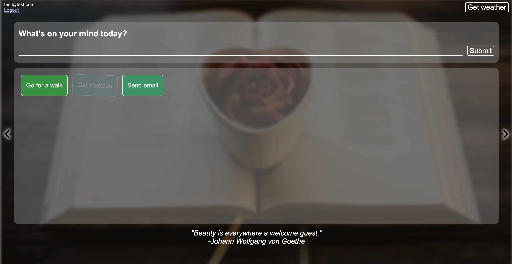

# Inspirational Homepage
This is a React-Redux to-do list application which allows the user to set their tasks. The user's visual experience is enriched with images, quotes and weather information fetched from APIs.
> [Live demo hosted by Netlify](https://inspirational-page-react.netlify.app/)

## Table of Contents
* [Features](#features)
* [Technologies Used](#technologies-used)
* [Screenshots](#screenshots)
* [Setup](#installation-and-setup-instructions)
* [Acknowledgements](#acknowledgements)

## Features
### Weather
The app uses users' coordinates in order to fetch the local weather from openweathermap.org at your current location. Users should allow sharing their's location.

### Goals
You can type in your tasks to put them on the list. The goals can be marked as done and they can be removed. The goals get random colors with contrast with white font, The tasks marked as done gets 80% opacity. All tasks could be deleted to disappear from the screen.

### Quote
You get a random daily inspirational quote from api-ninjas.com. One query takes series of 10 quotes from the API, and when the user reaches the last quote, the app gets new series of quotes.

### Image
The homepage fetches series of 15 background images from Unsplash that you can toogle through. If there is not connection or API limit is reached then the app uses 3 local images.

## Technologies Used
- [React](https://reactjs.org/)
- [Redux](https://redux.js.org/)
- [Redux Toolkit](https://redux-toolkit.js.org/)
- [Typescript](https://www.typescriptlang.org/)
- HTML5
- CSS3
- [Netlify functions](https://docs.netlify.com/functions/overview/)

## Screenshots

## Installation and Setup Instructions

Clone this repo and run npm install to install dependencies. This project will require connecting to [Unsplash](https://unsplash.com/), [Open Weather](https://openweathermap.org/) and [API-Ninjas](https://api-ninjas.com/) APIs - which will involve setting up an account with each service. 

## Acknowledgements
- The idea of the application was taken on [CodeAcademy](https://www.codecademy.com/projects/portfolio/inspirational-homepage)
- Many thanks to Joseph Mawa for the Freecodecamp's article on how to use serverless Netlify functions to access external APIs and secure API secrets. https://www.freecodecamp.org/news/how-to-access-secret-api-keys-using-netlify-functions-in-a-react-app/
